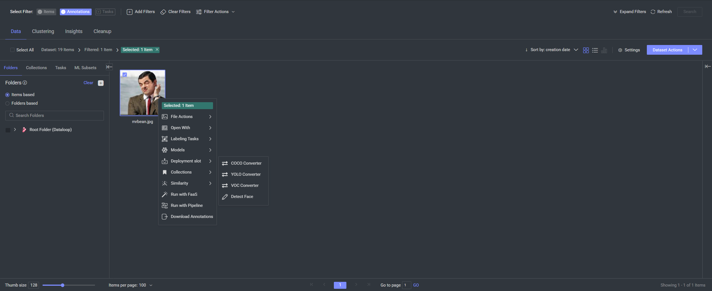

# Face Detection App

Welcome to the Face Detection App repository, a simple example application that demonstrates how to add a custom option to a toolbar menu in the Dataloop platform. This app uses OpenCV for face detection. To install the app, you'll need to run the `creation.py` script which will publish and install the app in your Dataloop project.

## Table of Contents

1. [Overview](#overview)
2. [Installation](#installation)
3. [Components](#components)
4. [App Code Overview](#app-code-overview)
5. [Configuration Overview](#configuration-overview)
6. [Additional Information](#additional-information)

## Overview

The Face Detection App utilizes OpenCV to detect faces in images. It provides a simple interface within the Dataloop platform, allowing users to easily apply face detection to images in their datasets. The main objective is to create a button in the item's right-click menu that triggers the face detection functionality, making it convenient for users to detect and annotate faces in their images.

### Key Features

- **Face Detection**: Detect faces in images using OpenCV.
- **Integration with Dataloop**: Seamlessly integrates with the Dataloop platform for easy deployment and use.

## Installation

To install the Face Detection App using the Dataloop SDK, follow these steps:

1. **Install the Dataloop SDK**: Ensure you have the Dataloop SDK installed. You can install it using pip:
   ```bash
   pip install dtlpy
   ```

2. **Log in to Dataloop**: Open a Python environment and log in to your Dataloop account:
   ```python
   import dtlpy as dl
   dl.login()
   ```

3. **Run the `creation.py` Script**: This script automates the process of publishing and installing the app:
   ```bash
   python creation.py
   ```

   - **Login**: The script starts by logging into the Dataloop platform.
   - **Project Access**: It retrieves your project using the specified project name.
   - **Publish DPK**: The script publishes the DPK (Dataloop Package) to the app store using the `dataloop.json` manifest file.
   - **App Update or Install**:
     - If the app already exists in your project, it updates the app with the latest DPK version.
     - If the app is not found, it installs the app in your project.

4. **Access the App**: Once installed, you can access the app through the Applications tab in the Dataloop marketplace. After installation, the detect face detection functionality will be available in the item's right-click menu as shown below:



## Components

The solution comprises several key components as defined in the `dataloop.json` file:

- **Toolbars**: Provides a "Detect Face" button in the item menu.
- **Modules**: Includes a `face-detector` module with a `predict` function to process items.
- **Services**: Configures a service for the `face-detector` module with specific runtime settings.

## App Code Overview

The `face_detection.py` script is responsible for managing the app's face detection functionality:

- **Face Detection**: Utilizes OpenCV to detect faces in images.
- **Annotation**: Automatically annotates detected faces in the Dataloop platform and upload the bounding boxes to the item.

## Configuration Overview

The `dataloop.json` file serves as the core configuration for the app. It defines various parameters, including app details, compute resources, modules, and services.

### Key Components

- **App Information**: Includes display name, description, and version.
- **Attributes**: Defines the app’s characteristics, such as category and media type.
- **Components**: Defines the components of the app.
    - **Toolbars**: By adding this component, we specify that we want to add a button to the item's right-click menu that will trigger our face detection functionality.
        - **Invoke**: Specifies which function to call when the button is clicked.
        - **Icon**: Defines the visual icon shown for the button.
        - **Location**: Sets where the button appears (in this case, the item's context menu).
    - **Modules**: Defines the code modules that make up the app's functionality.
        - **Name**: The unique identifier for the module (e.g., "face-detector").
        - **Init Inputs**: Parameters required when initializing the module (empty in this case).
        - **Functions**: Methods exposed by the module that can be called by the app.
            - Each function specifies its name, display name, input parameters, and return type.
            - In this app, the "predict" function takes an Item and returns an annotated Item.
    - **Services**: Configures how the modules are deployed and run.
        - Specifies compute resources (pod type, number of replicas, etc.)
        - Defines autoscaling behavior based on queue length
        - Sets the Docker image containing required dependencies

## Additional Information

For more details on using the Face Detection App, refer to the Dataloop platform documentation. Contributions and feedback are welcome to help improve this app.